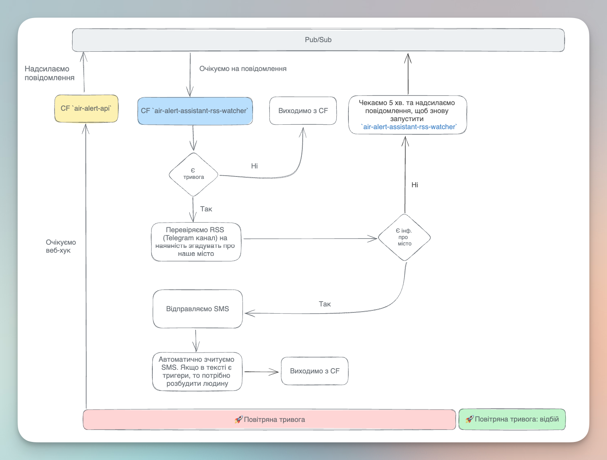

# Проект "Air Alarm Assistant"

Проект для сповіщення про тривоги повітря в конкретному регіоні. 
Використовує різні джерела інформації та надсилає сповіщення через SMS.
Дає можливість не прогавити небезбеку вночі.

## Опис логіки
Структура проекту:
1. Cloud Function з назвою `air-alert-api`. Код у файлі `watcher.py`. Ця функція реагує на веб-хуки з сервісу сповіщення про повітряні тривоги. Якщо повітряна тривога у важливому регіоні, то ця функція відправляє івент у Google Pub/Sub.
2. Cloud Function з назвою `air-alert-assistant-rss-watcher`. Код у файлі `main.py`. Ця функція реагує на нові повідомлення у Google Pub/Sub топіку. Запускається, якщо є нові івенти. Перевіряє чи є повітряна тривога у важливому регіоні. Якщо повітряна тривога активна, то перевіряє спеціальний RSS-канал на наявність тригерний слів. Наприклад, назва вашого міста. Якщо ці слова є, то відправляє івент у сервіс eSputnik. В свою чергу eSputnik відправляє на ваш номер телефону SMS повідомлення. На вашому iPhone потрібно налаштувати автоматизацію через додаток `Команди`, яка буде відслідковувати SMS повідомлення зі специфічним текстом. Якщо воно буде, то автоматизація на iPhone має запустити таймер, який вас розбудить та подзвонити вашому партнеру.
Якщо повідомлень у RSS-каналі немає, то функція `air-alert-assistant-rss-watcher` зачекає 5 хвилин та згенерує івент у Google Pub/Sub, який запустить функцію `air-alert-assistant-rss-watcher` (циклічний запуск). Якщо у важливому регіоні повітряна тривога буде припинена, то функція `air-alert-assistant-rss-watcher` буде зупинена.

## Схема

